# 3-hafta-odev-gorkemetem

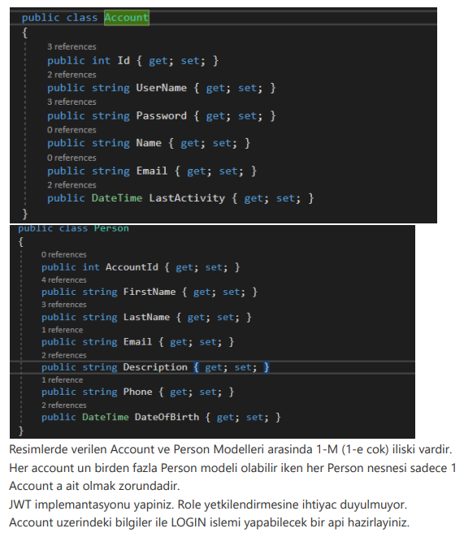
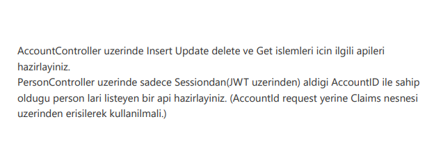

Bu proje account oluşturulup sisteme bu account bilgileri kullanılarak giriş yapılmasını sağlayan bir projedir. Bunun için JWT kullanılmıştır.
Sistemde Account ve Person olmak üzere iki tablo bulunmaktadır. Bu tabloların ekleme silme listeleme gibi işlemleri WebApi üzerinden gerçekleşecek şekilde yazılmıştır.
Aşağıda swagger üzerinde yapılan testlerin ekran görüntüleri bulunmaktadır.
## Ekran Görüntüleri
    Token:
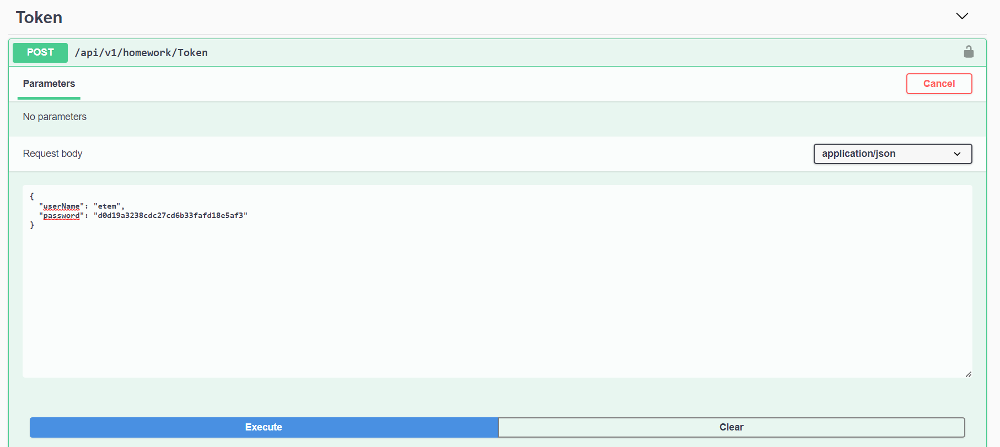
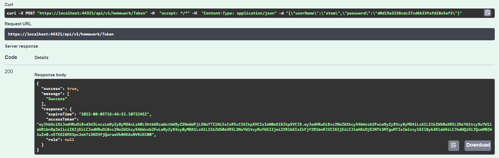
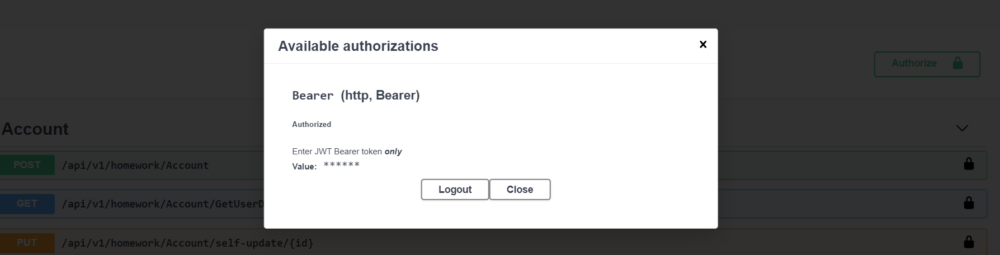

Account:
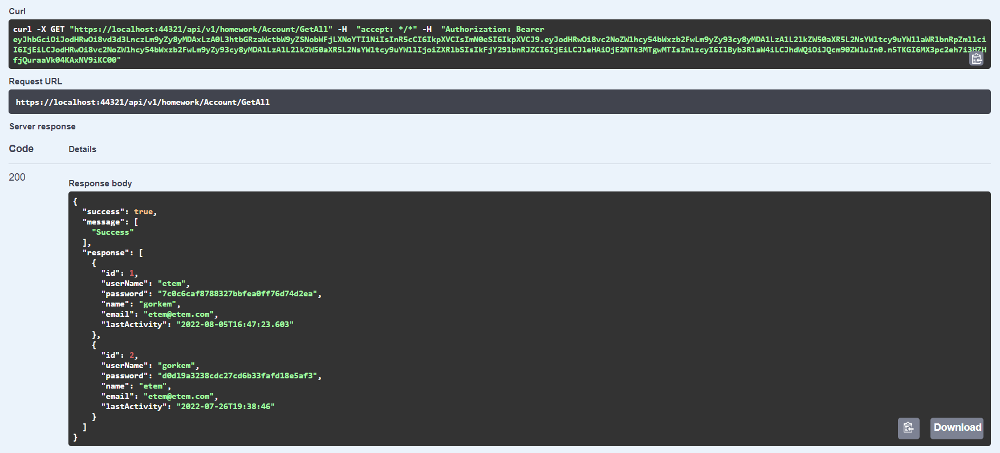
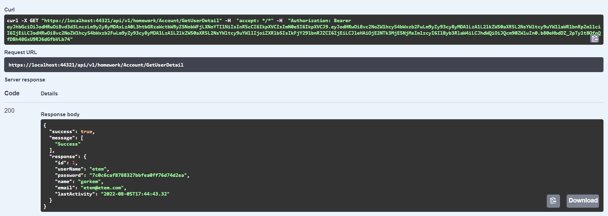
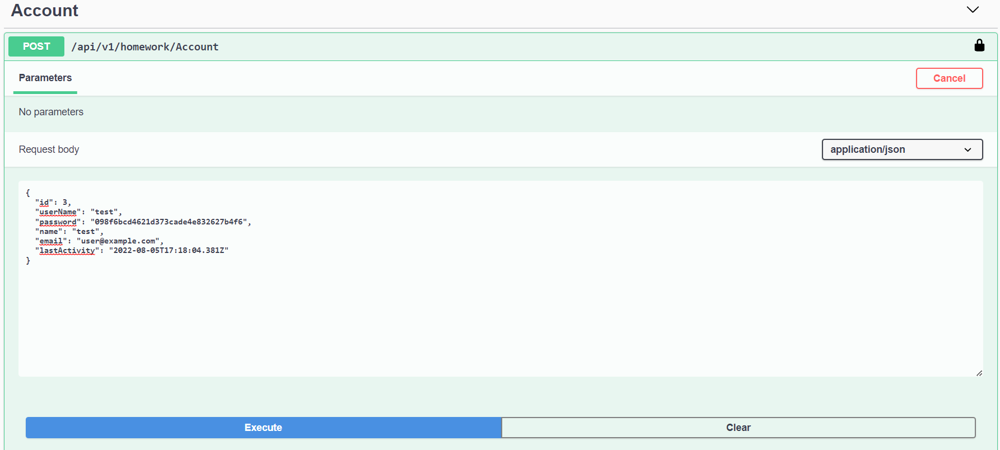
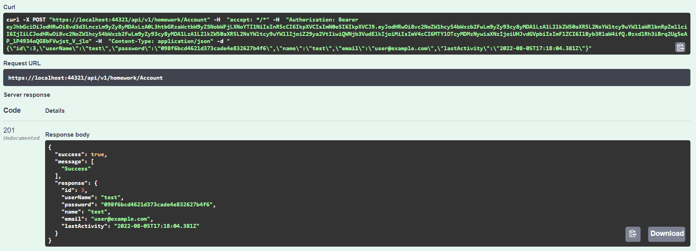

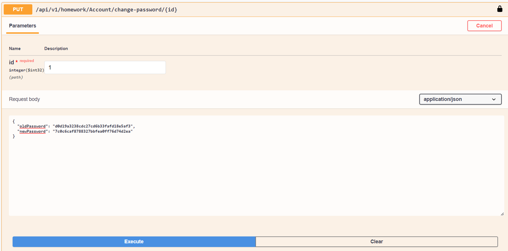
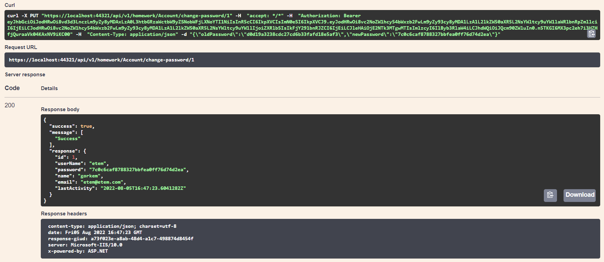
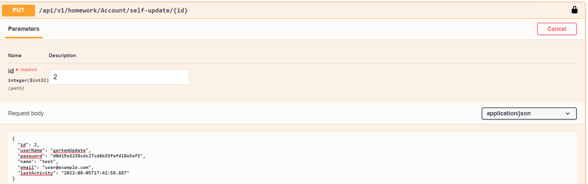
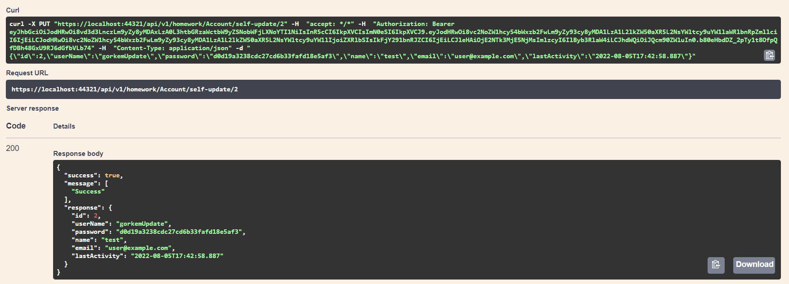

Person:
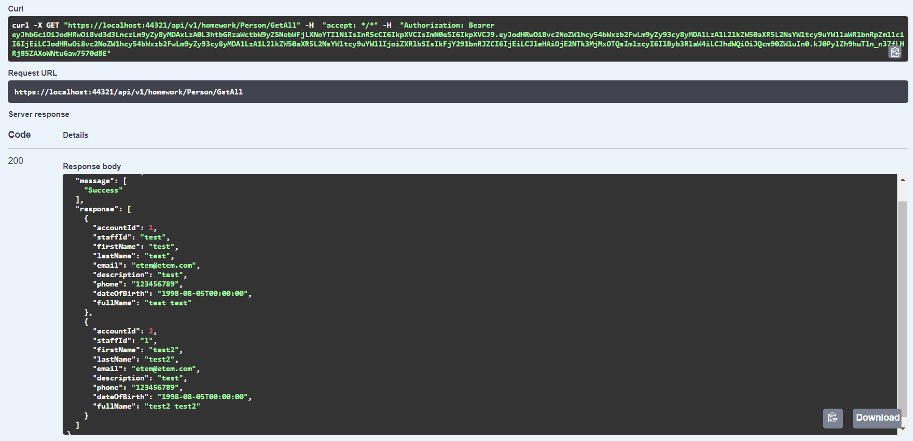
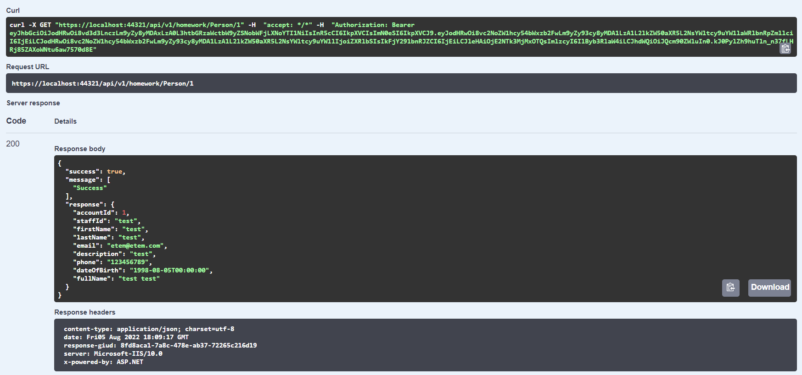
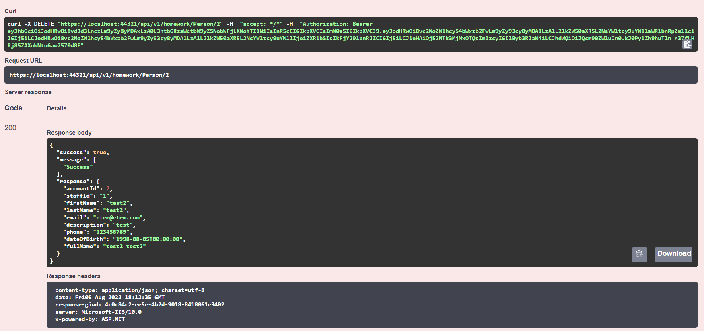
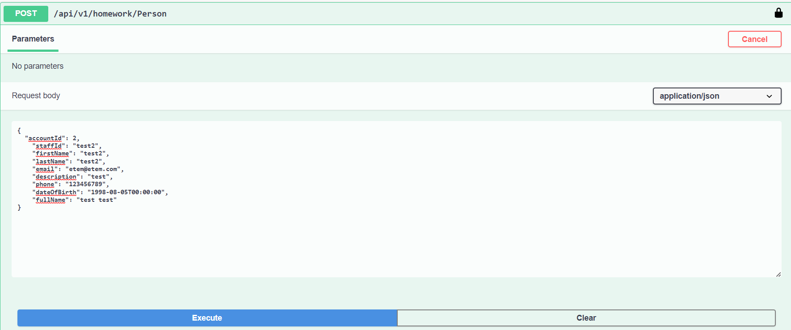

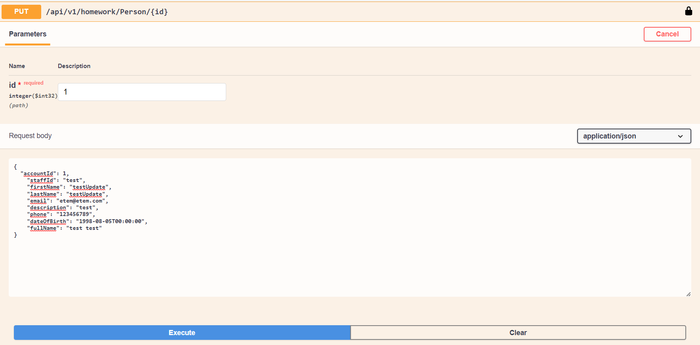
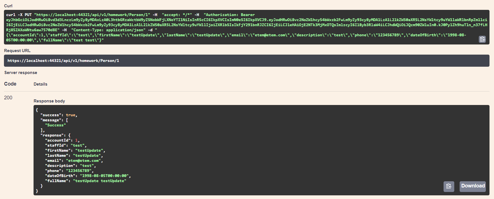
